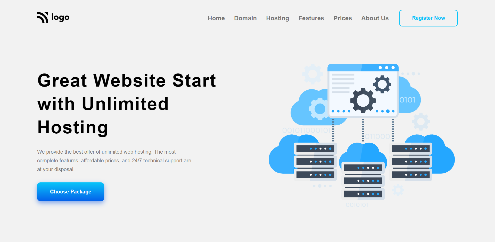

# HOSTING Web Page

## Project 11 🚀 Website's [Live Link](https://hosting-hub.netlify.app/)🔗

>by Arpit Pathak

Screenshot

<<<<<<< HEAD

=======

>>>>>>> 67799f430651d80b43657e114b003afb99509370

## What I learned from this Project? 

- Learned about Flexbox and its properties `justify-content`, `align-items`, `gap` & `flex-direction`.
- I have learned how to design beautiful buttons with resuable code and effects when hovering over them.
- Developed an understanding of CSS variables and their uses with colors and gradient values.
- Learned how to design fancy pricing cards.
## Time taken to finish this project ⏳
<<<<<<< HEAD
- 08 hours
=======
- 4.5 hours
>>>>>>> 67799f430651d80b43657e114b003afb99509370
---

