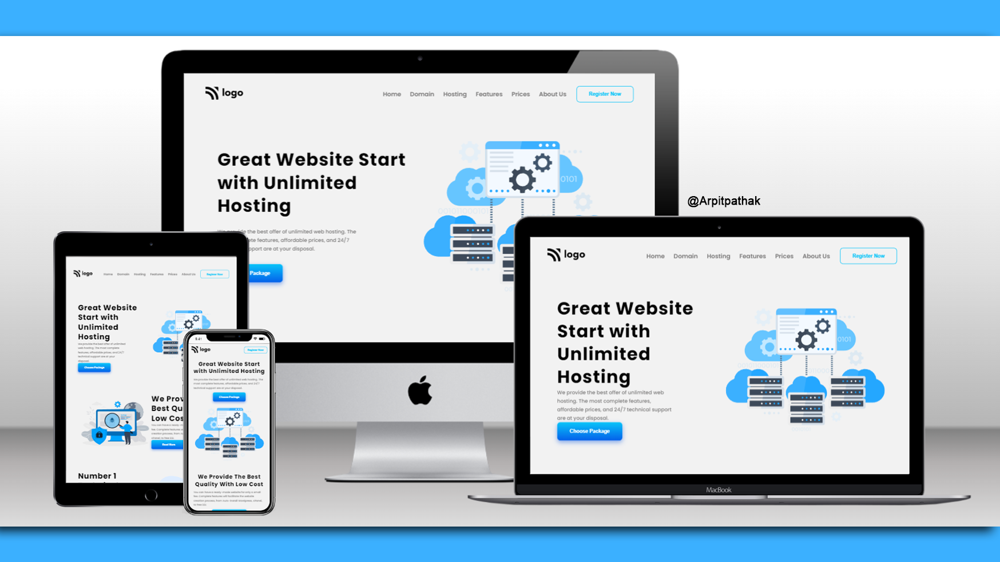

# HOSTING Web Page 🌐

## Project 11 🚀 Website's [Live Link](https://hosting-hub.netlify.app/)🔗

>by Arpit Pathak

### Screenshot

### website on different devices

### Mobile view

## 📌 What I learned from this Project? 📝

- Learned about Flexbox and its properties `justify-content`, `align-items`, `gap` & `flex-direction`.
- I have learned how to design beautiful buttons with resuable code and effects when hovering over them.
- Developed an understanding of CSS variables and their uses with colors and gradient values.
- Learned how to design fancy pricing cards.
- Learned about media query to make website responsive.

## 📌 Time taken to finish this project ⏳
- 08 hours + 1.5 hour to make website responsive
---

